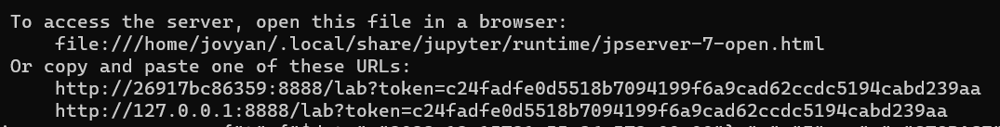

# Project Setup with Docker and Docker-compose

This project is set up using Docker and Docker-compose. Docker manages the application with `Mongo DB` and `PostgreSQL` databases, along with `JupyterLab`.

## Prerequisites
- Docker needs to be installed on the machine.
- Python should be installed.

## Contributors Here are some of the contributors to this project: 
1. [Aji Vishwambharan](https://github.com/ajivishnci)
2. [Aniket Ghadge](https://github.com/AniketLL)
3. [Ian Dias](https://github.com/Ian3000Dias)

# Steps to Run the Project

1. git clone this repo [DAP2023-project](https://github.com/ajivishnci/DAP2023-project.git) from github

2. Navigate to the project folder location and open a Windows command prompt.

    ```bash
    cd path/to/project/DAP2023-project
    ```

3. Execute the `docker` script.

    ```bash
    docker-compose up
    ```

4. Check if the all the container images is up and running, `Mongo DB`, `JupyterLab` and `PostgreSQL`

5. Open the `Jupyter notebook` link which you would see in the command line `ctrl + click`

    ```bash
    http://127.0.0.1:8888/lab?token=c24fadfe0d5518b7094199f6a9cad62ccdc5194cabd239aa
    ```
    you will find this cmd, please for this kind of link
    Copy and paste into your browser
6. Upload all the notebooks to Jupyter Lab in the `notebooks`  folder from our source code.
    ```bash
      First go into `/work/` folder in browser and then upload
    ```
7. Run the Python notebooks.

8. Execute the `docker` script when done, to remove the container from desktop

    ```bash
    docker-compose down
    ```

Make sure to follow these steps in sequence to successfully run the project.

### Note:
If you encounter issues with Docker containers for MongoDB or PostgreSQL:
Try restarting the container.

You can try the following commands in the terminal:

```bash
docker restart my_postgresql
docker stop my_postgresql
docker rm my_postgresql
docker volume ls
docker volume rm DAP2023-project_postgresql_data
docker-compose up -d

docker restart my_mongodb
docker stop my_mongodb
docker rm my_mongodb
docker volume ls
docker volume rm DAP2023-project_mongodb_data
docker-compose up -d
```